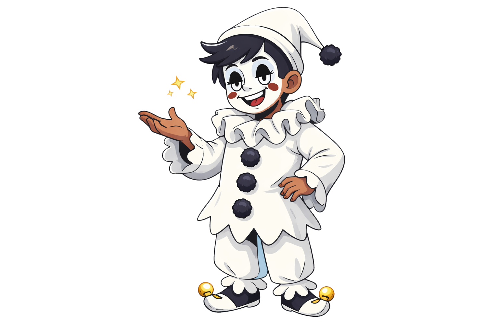

# 👋 Olá, eu sou o Bruno Martins ou Pierrot
🎮 Desenvolvedor de Jogos Digitais | Unity | Game Design

Sou desenvolvedor de jogos digitais com foco principal em desenvolvimento utilizando Unity e forte interesse em Game Design. Tenho experiência na criação de mecânicas de gameplay, sistemas e protótipos, com base sólida em Programação Orientada a Objetos utilizando C#.

Atualmente também faço parte do estúdio independente **Nephila**:spider_web:.
---
## 🚀 Sobre mim
* 🎓 Formado em Jogos Digitais
* 🎮 Foco em desenvolvimento com Unity
* 🧠 Interesse em Game Design e sistemas de gameplay
* 👥 Experiência com trabalho em equipe e coordenação
* 🌱 Aprendizado contínuo e desenvolvimento iterativo
---
## 🎮 Projetos em Destaque
### 🍳 [Cook & Conquer (Roguelike Procedural)](https://github.com/PierrotNobre/Project_RED)
Projeto desenvolvido durante o Kickstart da Tapps Games.
**Principais contribuições:**
* Geração de mapa procedural
* Inimigos escaláveis utilizando Scriptable Objects
* Desenvolvimento de mecânicas de gameplay
* Implementação em Unity com C#
* Colaboração com equipe multidisciplinar

### :bar_chart: [Rift Rivals (Roguelike Procedural)](https://github.com/InkNeko-Studio/RiftRivals)
Projeto desenvolvido durante a Faculdade de Jogos Digitais.
**Principais contribuições:**
* HUD Geral, o jogo contava com um sistema de servidor que se conectava na unity, toda a parte visivel da unity foi contruida por mim.
* Sistema de loja
* Controle de Cena
  
## 🚧Atualmente Organizando os repositórios🚧
---
## 📫 Contato
* Email: pierrotgamedev@gmail.com

---
✨ Sempre aberto a colaborar em projetos de jogos e novas oportunidades na indústria de games!
